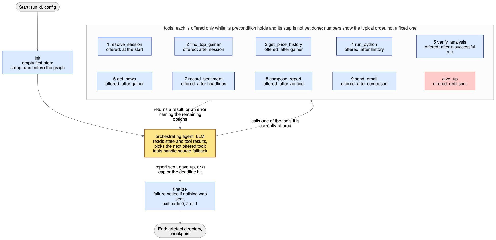

# NASDAQ Top-Gainer Agent

A proof of concept: an agent that picks the day's top NASDAQ gainer, has a language model analyse its last five trading sessions in a sandbox, and emails a report checked by reviewed code.

## What it does

The agent finds the NASDAQ common stock with the biggest close-to-close gain in the last completed trading session and has the language model write and run analysis code over the last five sessions in a sandbox. Reviewed code recomputes every number, and the agent emails a templated report built only from the verified result. When a second price source is configured, the stock's six closes are compared with it, and the report says whether they agree.

News comes from every news source: Massive, Yahoo and, once you turn it on, SEC EDGAR, whose filings often cover a small company's move when the press does not. The agent merges headlines that report the same story and lists the stories newest first. It summarises each one from the providers' own article summaries: what the story reports, what it means for the company, and how it may relate to the price move. The email shows each story once, with its title linked to the article and any other outlet that carried it listed under "Also reported by"; a title without a web link names its source instead. The written summary is plain English, with no metric names.

Right under the price line, a status line says whether you can trust the email: "everything worked", or "some things need your attention" followed by what is missing or doubtful. Warnings that change nothing about the run, such as a prior close under $5 or an early close, are listed there too. A grey footer says how the report was made, in plain words with the technical names in brackets: the data sources, the price basis, the sandbox that ran the code, and a reference to the run.



The design, the challenges and the error handling are explained in [REPORT.md](REPORT.md). This README covers setup and execution.

## Quick start

From a fresh clone to a replayed report in a few minutes, with no API keys. You need Python 3.12 exactly (the project pins below 3.13); Docker is optional.

```bash
python3.12 -m venv .venv && source .venv/bin/activate
make install              # pip install -c constraints.txt -e ".[dev]", pinned versions
cp .env.example .env      # leave it as it is for the tests and the replay
make test                 # unit and graph tiers, about half a minute, no network
AGENT_SANDBOX_BACKEND=subprocess make replay    # the bundled recording, no keys; see below for Docker
```

On Windows: `py -3.12 -m venv .venv`, `.venv\Scripts\activate`, then run the commands behind each target in the [Makefile](Makefile).

`make replay` plays the bundled cassette, a recording of the 2026-07-08 session, through the real graph, tools and sandbox, and writes the email to `runs/<run_id>/outbox/`. Each command prints one JSON line with the run id and exit code; `nasdaq-agent replay --check` also confirms that the exit code matches the recording, as CI does.

The model's code needs a sandbox, so a run without one stops at setup with a notice that names both choices. With Docker, build the image once, and `make replay` on its own uses it:

```bash
docker build -f docker/Dockerfile.sandbox -t nasdaq-agent-sandbox:0.2.0 .
make replay
```

Without Docker, the `AGENT_SANDBOX_BACKEND=subprocess` prefix chooses the subprocess sandbox, which screens the code but does not isolate it.

Keep the template's `AGENT_LLM_JUDGE_MODEL` while replaying: the recorded judge replies are filed under it, and a different judge model makes the replay miss them.

`constraints.txt` pins every dependency. It was frozen on macOS, and every pin was checked to resolve to a Linux x86_64 wheel for Python 3.12. The agent image installs the same set.

### First live run

Fill in three things in `.env`, then run `nasdaq-agent run`:

- `OPENROUTER_API_KEY`: required. The default model is pay-as-you-go, so add a few dollars of credit at openrouter.ai.
- `AGENT_EMAIL_TO`: the recipient. Without the SMTP lines, the email is written to the run's outbox instead of being sent.
- The sandbox: build the Docker image above, or set `AGENT_SANDBOX_BACKEND=subprocess`.

The free data keys, `MASSIVE_API_KEY`, `ALPHAVANTAGE_API_KEY` and `AGENT_SEC_USER_AGENT`, are optional; [Live](#live) says what each one adds. A run takes a few minutes. To run it every weekday, follow [Run it every weekday](#run-it-every-weekday).

## Running

There are three ways to run it: replay, live, and Docker Compose. The [Quick start](#quick-start) gives replay's commands.

`run`, `resume`, `record` and `replay` each print one JSON line to stdout, with `run_id`, `exit_code` and `artifacts_path`, then exit with the run's exit code. Log lines go to stderr, so `nasdaq-agent run | jq` sees only that line. `schedule` prints one line at each trigger instead. A usage error, or a failure before a run exists such as an invalid setting, prints one line to stderr and exits 1. Ctrl-C exits 130, the conventional interrupt code.

### Replay

Replay plays the recorded cassette through the real graph, tools and sandbox. It needs no API keys: it hands the models placeholder keys and turns off the pause between model calls. It always writes the email to the run's outbox, whatever SMTP settings are present. It fails loudly if the prompts have changed since the cassette was recorded. The recorded replies are filed under the model names and the library versions, so keep the template's `AGENT_LLM_JUDGE_MODEL`, and install with `make install`, which pins the versions in `constraints.txt`; replay reports any difference between the recording's environment and yours. Without a cassette, `make replay` exits 1 with a clear error and writes a failure notice to the outbox; see [Recording a new cassette](#recording-a-new-cassette).

### Live

Set `OPENROUTER_API_KEY` in `.env` and add credit to the account at openrouter.ai. Add the free data keys to reach the official sources:

| Key | Enables |
|---|---|
| `OPENROUTER_API_KEY` | The default model, GLM-5.3, and the template's fallback, DeepSeek V4.1 Flash, both pay-as-you-go on OpenRouter. Required; the account needs credit. |
| `MASSIVE_API_KEY` | Massive grouped daily closes (the first gainer source), the price-history fallback, news with sentiment labels, and the NASDAQ securities listed on a past day. |
| `ALPHAVANTAGE_API_KEY` | Alpha Vantage top gainers (the second gainer source), limited to 25 requests a day. |
| `AGENT_SEC_USER_AGENT` | SEC EDGAR filings as a news source: a company's current reports (Forms 8-K and 6-K). No key: SEC asks for your name and contact email instead, as in `Jane Doe jane@example.com`. |

Then run:

```bash
nasdaq-agent run                                        # or: make run
nasdaq-agent run --now 2026-09-24T22:00:00+00:00        # pin the clock; the offset is required
AGENT_SESSION_DATE=2026-07-08 nasdaq-agent run          # report on a past trading day
nasdaq-agent run --env-file other.env                   # use another settings file
nasdaq-agent resume --run-id 20260924T220000Z-abc123    # continue an interrupted live run
```

A pinned run sees only the news published by the pinned moment. Massive and SEC EDGAR are asked for exactly that window. Yahoo cannot filter by date: it returns its latest ten items, and those after the pinned moment are dropped, so for a date long past Yahoo may have nothing left.

`AGENT_SESSION_DATE` picks the trading day to report on, as `YYYY-MM-DD`; the run's clock is then 16:30 New York time that day, when the scheduler would have run. Leave it empty to report the last completed session. A day that is not a NASDAQ trading day, or whose session has not closed yet, is refused before the run starts, and so is `--now` together with it. `schedule` refuses to start while it is set, a resumed run keeps its pinned clock, and replay always reports the recording's own day.

A session before the day of NASDAQ's symbol file is filtered with the securities listed on NASDAQ that day, not today. The symbol file lists only today's securities, so a stock delisted since would otherwise be missed: on 2026-07-08 that named TVRD (+61.29%) over NVVE (+63.58%), which left NASDAQ afterwards. Massive's reference data says which securities were listed that day (six requests, saved in `runs/nasdaq_lists/` and reused, since a past day's list never changes). A security still in today's file is classified by the file as always; one gone since counts only if Massive calls it common stock or an ADR and its name has none of the excluded words. Such a run needs `MASSIVE_API_KEY`, and without it the gainer step stops with that reason. Every run records in `context.json` which list decided (`listing`), and each stock that outranked the ones checked but did not count, with the reason (`excluded_candidates`).

Resume works only for live runs, in live mode. It continues after the last completed tool call, and the resumed run spends what is left of the run's model-call and tool-call caps (25 each by default). The deadline, `AGENT_RUN_DEADLINE_SECONDS` (600 by default), starts again with each invocation. A replay run cannot be resumed: run the replay again. A recording cannot be resumed either: record again. If the settings changed since the run started, resume logs a warning and uses the current settings.

Without SMTP settings the email is written to `runs/<run_id>/outbox/` as an `.eml` file. To send real mail, set `AGENT_SMTP_HOST`, `AGENT_SMTP_PORT`, `AGENT_SMTP_USERNAME`, `AGENT_SMTP_PASSWORD` and `AGENT_SMTP_FROM`. The transport upgrades the connection with STARTTLS, so it works with relays that support STARTTLS, including Gmail with an app password. If a send fails before the server holds the message (no connection, or a temporary 4xx refusal), it retries after 10 and then 30 seconds. Rejected credentials, TLS errors and a connection lost mid-send are not retried, because a lost connection may already have delivered the message.

Without the two data keys, only the keyless Yahoo and Nasdaq.com screeners can find a gainer. Both are refused while the market is open, so a keyless run during trading hours exits 1. Yahoo also blocks some networks outright: during development it refused every request from our network, with HTTP 403 or a rate-limit error.

To run it every weekday, follow [Run it every weekday](#run-it-every-weekday).

### Sandbox: with or without Docker

With the default `AGENT_SANDBOX_BACKEND=auto`, each code attempt runs in the Docker sandbox when the daemon answers and the image exists. Build the image once:

```bash
docker build -f docker/Dockerfile.sandbox -t nasdaq-agent-sandbox:0.2.0 .
```

Without Docker or the image, the run stops at setup, before any model call, and sends a failure notice that gives the build command. The weaker subprocess sandbox runs the model's code only when you choose it with `AGENT_SANDBOX_BACKEND=subprocess`: it screens the code but does not isolate it. The Docker Compose stack sets it, because its agent container cannot reach Docker. Either way, the email's footer names the backend that ran the code. The subprocess sandbox was verified end to end on a machine with no sandbox image: the model's code ran, passed verification, and the report was written. The isolation differences are listed under [Disclosures](#disclosures).

### Docker Compose with a Mailpit inbox

```bash
make compose-up           # docker compose -f docker/compose.yaml up --build
```

The stack has two services. The agent container reads keys and `AGENT_EMAIL_TO` from `.env`, runs `nasdaq-agent run` once and exits. Mailpit catches the email at http://localhost:8025. Both Mailpit ports bind to 127.0.0.1 only.

A third service, `scheduler`, runs the daily schedule with the same lockdown. It starts only with the `schedule` profile, and it sends real mail through the SMTP relay in `.env` rather than Mailpit; see [Run it every weekday](#run-it-every-weekday).

How the stack is locked down:

- The agent uses the subprocess sandbox backend.
- The stack does not mount the Docker socket, because the socket gives root-equivalent access to the host.
- The agent container has a read-only filesystem and runs as a non-root user (uid 10001).
- It drops all capabilities and sets no-new-privileges.
- It is limited to 128 processes, 1536 MB of memory and 2 CPUs.

Disclosure: inside compose, model-written code has no network isolation of its own. The code gate's import allowlist and the container are the boundary. For network isolation, run on the host with the Docker backend, which starts every attempt with `--network none`:

```bash
docker build -f docker/Dockerfile.sandbox -t nasdaq-agent-sandbox:0.2.0 .
AGENT_SANDBOX_BACKEND=docker nasdaq-agent run
```

Artefacts live in the named volume `runs`. Copy them out with:

```bash
docker compose -f docker/compose.yaml cp agent:/runs ./runs-compose
```

Building the images needs Docker Hub access, for `python:3.12-slim` and `axllent/mailpit`.

## Tests

| Tier | Command | Covers | Needs |
|---|---|---|---|
| Unit | `make test-unit` (`pytest tests/unit -q`) | Metrics against a hand-computed fixture; calendar weekends, holidays and early closes; every adapter against mocked HTTP, including 429 then success and dead sources; the sandbox gate and runners; each tool's preconditions and integrity rules; grounding; email structure and the send marker; finalize and the run lifecycle, including resume after a simulated crash, caps shared across a resume and the run deadline | Nothing: no network, keys or Docker |
| Graph | `make test-graph` (`pytest tests/graph -q`) | The real three-node graph, tools and middleware driven by a scripted model over fake sources: source fallback, code repair, verifier rejection, give-up, news down, judge outage, chart error, headlines without sentiment, a failed news source then a successful one, judge rejection, send before verify, extra numbers in compose, resume after send, a loop that ends without sending; plus record and replay round trips and their failure paths | Nothing |
| End to end | `make replay` | The recorded cassette through the real graph and sandbox | The bundled cassette, `.env` as copied from the template, and a sandbox: the Docker image, or `AGENT_SANDBOX_BACKEND=subprocess` |

`make test` runs the unit and graph tiers. The Docker tests in `tests/docker` run with `pytest tests/docker -q`; they skip with a stated reason when the daemon is unreachable or the sandbox image is not built. CI (`.github/workflows/ci.yml`) runs the unit and graph tiers on every push and pull request. When `fixtures/cassettes/manifest.json` exists, it also copies `.env.example` to `.env` and runs `nasdaq-agent replay --check` in the subprocess sandbox, since the runner has no Docker image.

## Run it every weekday

These steps take a fresh clone to a report in your inbox after every trading session.

### Step 1: install

```bash
git clone <repository-url> nasdaq_analysis_agent
cd nasdaq_analysis_agent
python3.12 -m venv .venv
source .venv/bin/activate
make install
cp .env.example .env
```

### Step 2: get the keys

| Key | Where | What for |
|---|---|---|
| OpenRouter key, with credit | openrouter.ai: create a key, then add credit | Every live run. Required. |
| Massive key | massive.com: free sign-up | The first gainer source, the price-history fallback and a news source. Recommended. |
| Alpha Vantage key | alphavantage.co: free key | The second gainer source. Recommended. |
| SEC contact | Nothing to sign up for: your name and email address | SEC EDGAR filings as a news source. Optional. |
| Gmail app password | Google Account, Security: turn on 2-Step Verification, then create an app password | Sending the email through Gmail. Any SMTP relay with STARTTLS works too. |

### Step 3: fill in `.env`

```dotenv
OPENROUTER_API_KEY=...
MASSIVE_API_KEY=...
ALPHAVANTAGE_API_KEY=...
AGENT_SEC_USER_AGENT=Your Name you@example.com
AGENT_EMAIL_TO=you@example.com
AGENT_SMTP_HOST=smtp.gmail.com
AGENT_SMTP_PORT=587
AGENT_SMTP_USERNAME=you@gmail.com
AGENT_SMTP_PASSWORD=your-app-password
AGENT_SMTP_FROM=you@gmail.com
AGENT_SCHEDULE_CRON=30 16 * * 1-5
AGENT_SCHEDULE_TIMEZONE=America/New_York
```

`AGENT_EMAIL_TO` receives the report. The last two lines are the defaults: 16:30 New York time, Monday to Friday, half an hour after the close. Without the SMTP lines, each report is written to `runs/<run_id>/outbox/` instead of being sent.

### Step 4: check one run by hand

```bash
nasdaq-agent run
```

A run takes a few minutes and prints one JSON line. Exit code 0 means the report was sent, 2 that it was sent with problems, which the email lists under its status line, and 1 that no report was sent and a failure notice went out instead. [What a run leaves behind](#what-a-run-leaves-behind) explains each case.

### Step 5: keep the scheduler running

Pick one of three ways.

**Docker, on any system with Docker.** This is the easiest way to keep it running:

```bash
docker compose -f docker/compose.yaml --profile schedule up -d --build scheduler
docker compose -f docker/compose.yaml --profile schedule logs -f scheduler
```

Docker restarts the container after a crash, and after a reboot once Docker itself is running. On Docker Desktop, turn on starting it when you sign in. Runs and reports stay in the `runs` volume; copy them out with `docker compose -f docker/compose.yaml --profile schedule cp scheduler:/runs ./runs-scheduler`. Inside the container, model-written code runs in the subprocess sandbox, isolated as described in [Docker Compose with a Mailpit inbox](#docker-compose-with-a-mailpit-inbox).

**Linux with systemd.** Replace the paths and user in [ops/nasdaq-agent-schedule.service](ops/nasdaq-agent-schedule.service), then:

```bash
sudo cp ops/nasdaq-agent-schedule.service /etc/systemd/system/
sudo systemctl daemon-reload
sudo systemctl enable --now nasdaq-agent-schedule
journalctl -u nasdaq-agent-schedule -f
```

**A terminal, to try it.** `make schedule` runs until you press Ctrl-C or close the terminal.

### Step 6: confirm it fires

The scheduler first prints the next run time, for example `{"next_run": "2026-09-28T16:30:00-04:00"}`, and waits. After each trigger it prints the session, run id and exit code, or `"skipped"` when that session was already reported. To see a trigger without waiting, set `AGENT_SCHEDULE_CRON` a few minutes ahead, for example `42 14 * * *` for 14:42 in `AGENT_SCHEDULE_TIMEZONE`. Restart the scheduler, watch the log, then set the schedule back.

### How the schedule works

- **The expression.** `AGENT_SCHEDULE_CRON` is a standard five-field crontab line, read in `AGENT_SCHEDULE_TIMEZONE`, so `0 18 * * 1-5` means 18:00 on weekdays. To run in your own time zone, set both. For example, `0 9 * * 1-5` with `Asia/Hong_Kong` runs at 09:00 Hong Kong time on weekdays, each run reporting the New York session that closed overnight, and Monday's run reports Friday's session. An invalid expression or time zone stops the scheduler at startup. So does an expression that restricts both the day of the month and the day of the week, because crontab would run when either matches.
- **Weekends and holidays.** The default never fires at weekends. On a market holiday the trigger finds that the last completed session was already reported, and skips it.
- **What counts as reported.** The scheduler records the last reported session in `schedule_state.json`, in the artifacts directory. It records a session only when its report went out, with exit 0 or 2. A failed run's session is tried again at the next trigger that still finds it the last completed session. The scheduler remembers only its own runs, so a manual `nasdaq-agent run` does not stop it reporting the same session.
- **The machine must be awake.** A trigger missed while the machine slept runs within a minute of waking.
- **Changing settings.** Settings are read once at start, so restart the scheduler after editing `.env`. Under Docker, use `docker compose -f docker/compose.yaml --profile schedule up -d --force-recreate scheduler`; under systemd, `sudo systemctl restart nasdaq-agent-schedule`.
- **Stopping it.** Press Ctrl-C, and it prints `{"schedule": "stopped"}`. Under Docker, use `docker compose -f docker/compose.yaml --profile schedule stop scheduler`; under systemd, `sudo systemctl disable --now nasdaq-agent-schedule`.
- **Without the scheduler.** [ops/cron.example](ops/cron.example) shows a crontab line and a systemd timer that start one run at a time. Neither can read `.env`, because its schedule is written in the file itself, and neither skips holidays.

## Configuration

Settings come from the environment and `.env`. Application settings use the `AGENT_` prefix; provider keys keep their native names. An unknown key in `.env` fails validation, so a typo fails fast. If your `.env` came from an older `.env.example`, delete its `AGENT_QUALITY_PRESET` line: that setting was removed, and unknown settings are rejected.

| Setting | Default | Meaning |
|---|---|---|
| `AGENT_LLM_MODEL` | `openrouter:z-ai/glm-5.3` | Orchestrator model, as `provider:model`. `openrouter:` takes any OpenRouter model id, free or paid. `google_genai:` and `anthropic:` reach Gemini and Claude where those providers operate; neither serves Hong Kong. |
| `AGENT_LLM_JUDGE_MODEL` | unset (uses `AGENT_LLM_MODEL`); the template sets `openrouter:moonshotai/kimi-k3` | Model for the grounding judge. A judge from a different lab than the writer checks it more independently, since judges tend to favour their own model's writing. About 2 cents a run on Kimi K3. |
| `AGENT_LLM_FALLBACK_MODEL` | unset; the template sets `openrouter:deepseek/deepseek-v4.1-flash` | Model tried when a call to the primary model fails. A model from another lab on other hosts keeps one outage from stopping both. |
| `AGENT_LLM_CALL_DELAY_SECONDS` | `4` | Pause between model calls, for free-tier limits. Replay forces 0. |
| `AGENT_LLM_TIMEOUT_SECONDS` | `90` | How long one model request may take before it is abandoned. A late answer is never used; the request is retried or the fallback model takes over. |
| `AGENT_LLM_MAX_RETRIES` | `2` | Retries of a failed or timed-out model request before the fallback model, or failure. With the defaults, a model and its fallback wait at most 540 seconds, inside the run deadline. |
| `AGENT_LLM_MAX_OUTPUT_TOKENS` | `16384` | Largest reply one model call may produce, thinking included. Caps the credit OpenRouter reserves per request; a reply that reaches it is cut off, and the failure notice says so. |
| `AGENT_MAX_MODEL_CALLS` | `25` | Model calls allowed per run, shared across resumes. |
| `AGENT_MAX_TOOL_CALLS` | `25` | Tool calls allowed per run, shared across resumes. |
| `AGENT_MAX_CODE_RUNS` | `6` | `run_python` calls allowed per run. |
| `AGENT_MODE` | `live` | `live`, `replay` or `record`. The `replay` and `record` commands set it. |
| `AGENT_SANDBOX_BACKEND` | `auto` | `auto`, `docker` or `subprocess`. `auto` and `docker` use Docker when the daemon answers and the sandbox image exists, and otherwise stop the run at setup with a failure notice. `subprocess` runs the code in the weaker subprocess sandbox; only this explicit choice selects it. |
| `AGENT_EMAIL_TRANSPORT` | `auto` | `auto`, `smtp` or `file`. `auto` picks SMTP when `AGENT_SMTP_HOST` is set. |
| `AGENT_EMAIL_TO` | required | Recipient. One plain address, never taken from model output. |
| `AGENT_SMTP_HOST` | unset | SMTP server. |
| `AGENT_SMTP_PORT` | `587` | SMTP port. |
| `AGENT_SMTP_USERNAME` | unset | SMTP login. Required when SMTP is selected. |
| `AGENT_SMTP_PASSWORD` | unset | SMTP password. Required when SMTP is selected; redacted in logs and failure notices. |
| `AGENT_SMTP_FROM` | unset | Sender address. Required when SMTP is selected. |
| `AGENT_SMTP_STARTTLS` | `true` | Upgrade the SMTP connection with STARTTLS. The compose stack turns it off for Mailpit. |
| `AGENT_LOOKBACK_SESSIONS` | `5` | Daily returns in the analysis window; one more close is fetched. Must be 5: the metrics are defined over five daily returns, so any other value is refused when the settings load. |
| `AGENT_NEWS_LOOKBACK_DAYS` | `3` | How many days before the session to look for headlines, from 1 to 90. |
| `AGENT_SESSION_DATE` | unset | The trading day to report on, as `YYYY-MM-DD`. The run's clock is pinned to 16:30 New York time that day. Unset reports the last completed session. Refused with `--now`, by `schedule`, and for a day without a completed session. |
| `AGENT_SEC_USER_AGENT` | unset | Turns on SEC EDGAR filings as a news source. Your name and contact email, as SEC's fair-access policy asks (`Jane Doe jane@example.com`): one line of printable ASCII, at most 200 characters, checked at startup. Sent only to SEC; redacted in logs. |
| `AGENT_SCHEDULE_CRON` | `30 16 * * 1-5` | When `nasdaq-agent schedule` runs the agent: a standard five-field crontab expression. Checked at startup. |
| `AGENT_SCHEDULE_TIMEZONE` | `America/New_York` | The IANA time zone the schedule is read in. Checked at startup. |
| `AGENT_BENCHMARK_SYMBOL` | `SPY` | Benchmark for relative performance. |
| `AGENT_ARTIFACTS_DIR` | `./runs` | Per-run directories, the symbol-file cache, the saved NASDAQ lists of past days and the Alpha Vantage quota counter. |
| `AGENT_CASSETTE_DIR` | `./fixtures/cassettes` | Where `replay` reads the cassette and `record` swaps in a new one. It may hold only cassette entries. |
| `AGENT_RUN_DEADLINE_SECONDS` | `600` | Seconds each invocation may run, checked before every model call; a run past it stops before its next call. It does not interrupt a tool call in progress. Must be a positive integer. |
| `AGENT_HTTP_CONNECT_TIMEOUT` | `5` | Connect timeout in seconds for every call through the shared HTTP client. |
| `AGENT_HTTP_READ_TIMEOUT` | `10` | Read timeout in seconds for the same calls. |
| `OPENROUTER_API_KEY` | unset | Key for OpenRouter models, including the default. |
| `GOOGLE_API_KEY` | unset | Key for Gemini models through `google_genai:`, where Gemini is offered. |
| `ANTHROPIC_API_KEY` | unset | Key for Claude models. |
| `MASSIVE_API_KEY` | unset | Free Massive key: grouped daily closes, daily aggregates, news, and the NASDAQ list of a past day. |
| `ALPHAVANTAGE_API_KEY` | unset | Free Alpha Vantage key: top gainers, counted against 25 requests a day. |
| `LANGSMITH_TRACING` | `false` | Tracing passthrough. LangChain reads it from the process environment, so export it in the shell; a value set only in `.env` is accepted but not passed on. Replay turns tracing off. |
| `LANGSMITH_API_KEY` | unset | Tracing passthrough, as above. |
| `LANGSMITH_PROJECT` | unset | Tracing passthrough, as above. |

## What a run leaves behind

```text
runs/
  nasdaqlisted.txt          official NASDAQ symbol file, cached for 24 hours (live runs)
  nasdaq_lists/             Massive's NASDAQ list for each past session a live run reported, one file per day
  quota.json                Alpha Vantage daily request counter, once that source is used
  <run_id>/                 one directory per run, for example 20260926T133830Z-6f832a
    context.json            the run state, including the mode it ran in, saved after every tool call
    tool_log.jsonl          one line per tool call: number, tool, arguments, outcome, time
    log.jsonl               structured JSON log, secrets redacted, including the tools offered per model call
    checkpoints.sqlite      LangGraph checkpoints for the graph and the agent loop
    sandbox/                ticker.csv, benchmark.csv, meta.json, and the latest script with its bootstrap
    attempts/               attempt_N.py, .out and .err for every executed run_python attempt
    verification.json       each metric's model value, verifier value and verdict
    chart.png               six-session chart, shown once inline in the email; absent if it failed to render
    report.txt              plain-text part of the email
    report.html             HTML part of the email
    outbox/                 .eml files from the file transport, and from any SMTP fallback
    sent.json               the report's send marker: sending, sent or failed
    sent.eml                copy of the delivered report
    failure_sent.json       the failure notice's send marker, on failed runs
    closing_summary.txt     the agent's closing message; stored, never sent
    summary.json            exit code, gainer, degradations, redacted errors, tool-call count
```

| Exit code | Meaning |
|---|---|
| `0` | The report was sent with no degradations. |
| `2` | The report was sent with degradations. `summary.json` lists each one by its fixed note, below, and the email states each one in plain words under its status line. |
| `1` | No report was sent. The agent gave up, hit a cap or the run deadline, or ended without sending; setup failed; the transport failed; or a replay missed its cassette. A failure notice goes to the recipient. When a previous send's outcome is unknown, the notice says so and no second report is sent. In record mode, exit 1 also means the recording could not be sealed, even though the report went out. |

Every cause of exit 2, with its note:

| Note | Cause |
|---|---|
| `news unavailable from every source` | News sources were tried and none succeeded. |
| `news was not fetched` | News was never requested. |
| `sentiment unavailable` | Headlines arrived, but no sentiment was recorded. |
| `closes disagree with a second price source` | At least one of the stock's six closes differs from a second price source by more than 0.5% of the larger close. A check that cannot be made, such as across a split, is explained in the footer and does not change the exit code. |
| `chart unavailable` | The chart failed to render, so the email goes out without it. |
| `judge unavailable: prose checked by the deterministic layer only` | The judge call failed in a live run. In replay a missing judge response fails the run, and in record mode a judge failure stops the seal. |
| `narrative is template-generated after grounding failures` | The written summary still failed the fact check after two rewrites. |

The news, sentiment, chart and template-narrative notes are decided again each time the report is rendered, so an attempt that fails to render leaves none of them behind. `get_news` asks every news source, so a source that answers with no headlines is not a degradation, and the News section says there is no news only when none has any. A source that fails while another answers is named in a warning under the status line, but the run is not degraded, because the news is there. If the model replies without calling a tool before the report is sent, the agent reminds it, at most twice, before the run may end. A judge outage in a live run degrades the run to exit 2 but never fails it.

## Disclosures

- **Official sources first.** `auto` tries the official APIs, Massive and Alpha Vantage, before the screeners, and the universe comes from the official nasdaqtrader.com symbol file. The Yahoo and Nasdaq.com screeners are unofficial. They are allowed only while the market is closed and at most once per run. Nasdaq.com requests go through the shared client, which never retries a 403 and retries HTTP 500, 502, 503 and 504 twice within a few seconds. A 429 waits as long as the server's `Retry-After` says, up to a minute, or else backs off from 2 seconds, doubling; it gets up to six attempts and 90 seconds of waiting in all.
- **Yahoo and yfinance.** yfinance supplies the Yahoo screener, price history and a news fallback. Its documentation says it is not affiliated with Yahoo, is intended for research and educational purposes, and that the Yahoo Finance API is intended for personal use only; it refers users to Yahoo's terms of use. Check those terms before any other use. A production deployment should replace it with a licensed source.
- **SEC EDGAR.** Filings are public records. The adapter follows SEC's fair-access policy: at most ten requests a second, each declaring `AGENT_SEC_USER_AGENT`. It finds filings through `efts.sec.gov` and `data.sec.gov` and reads a filing's details (form, items, document names and acceptance time). When a filing attaches a press release as an Exhibit 99, it also reads that exhibit from `www.sec.gov` and keeps the release's headline and its opening words, at most 600 characters; the rest of the filing is not read. `www.sec.gov` refuses requests that do not declare a contact (HTTP 403 to a generic User-Agent), so a refused or unreadable exhibit leaves the filing's details alone. It keeps current reports only, Forms 8-K and 6-K, and the email links each filing's index page on `www.sec.gov`.
- **Nasdaq.com robots.txt.** The Nasdaq.com screener calls `api.nasdaq.com`, whose robots.txt disallows all crawlers (`User-agent: *`, `Disallow: /`, checked 2026-09-26). The adapter sends browser-style headers: a desktop Chrome User-Agent, an Origin and a Referer. It is the last source `auto` tries.
- **OpenRouter.** OpenRouter passes each request to one of the model's hosting providers, and data policies differ by provider. Some free-model providers log prompts and responses and may use them for training; OpenRouter's privacy settings control which providers your account allows. Free models also have per-minute and daily request limits and were often congested during development, which is why the default is a paid model. The agent sends only public market data, public headlines, the generated analysis code with its error output, and its own prompts. It does not put keys or the recipient address in prompts. Before the model sees a traceback, the local sandbox directory and Python library paths are rewritten to the Docker sandbox's paths.
- **Sandbox limits.** The code gate is a best-effort static screen, not a security boundary. It rejects imports outside pandas, numpy, math, statistics, json and datetime; calls such as `eval`, `exec`, `open` and `getattr`; dunder names; pandas and numpy file readers and writers, including numpy's `fromregex`, `dump` and `dumps`; and `to_string`, `to_latex`, `to_markdown` and `to_html` calls that pass a path or buffer. It matches names, so a capability reached through an unlisted attribute chain, or by string dispatch such as `df.apply("to_csv", ...)`, can pass it. The Docker backend is the boundary.
- **Subprocess backend.** It is a fallback and logs a warning when used. It applies CPU-time, file-size and open-file limits, a 20-second wall-clock kill, an isolated interpreter and an empty environment. On macOS it cannot enforce a memory limit, because the address-space limit is applied only on Linux. It does not isolate the network or cap processes. As defence in depth, the bootstrap, which both backends run, disables Python's socket constructors and restricts `open()`: reads only under the sandbox directory and the interpreter's own installation, and no writes anywhere. That stops casual use, and the string-dispatch write above, but it is not isolation. Each email's footer names the backend that ran the code.
- **Compose.** Inside the compose stack, model-written code has no network isolation of its own, as described above.
- **Cassettes.** Recorded cassettes hold public market data, headlines, model responses and generated code. Recording refuses to finish if a configured secret appears in any cassette file.
- **Report checks.** The grounding judge is advisory, and the deterministic check ignores direction. There is no human approval step, which a regulated deployment would add.
- **How this was built.** I built this with Claude Code, following the Superpowers plugin's workflow: a written spec, a 27-task plan, then fresh implementer agents working through the plan. Claude researched the options and wrote the code, the tests and first drafts of [REPORT.md](REPORT.md) and this README. I made the scope and stack decisions and approved the design section by section. During spec review I reopened the architecture: a fixed graph with one agent node read as a pipeline, so it became the orchestrating agent in section 1 of the report. Reviewer agents checked every task, and a final review covered the whole codebase. Live runs caught what the tests missed, such as a sentence splitter that ended sentences at every closing bracket.

## Recording a new cassette

Record once with real keys, in an environment installed with `make install`, then commit `fixtures/cassettes`:

```bash
# .env must hold OPENROUTER_API_KEY and MASSIVE_API_KEY
make record               # AGENT_MODE=record nasdaq-agent record
```

- `record` runs live and captures every HTTP and model response into a staging directory beside `AGENT_CASSETTE_DIR`, named `.<cassette>.recording-<run id>`; with the default setting that is `fixtures/.cassettes.recording-<run id>`.
- It swaps the recording in only after a clean seal: the run exits 0 or 2, the judge never failed, and no configured secret appears in any cassette file. Sealing writes `manifest.json`, holding the run's clock, a fingerprint of the prompts, the key-gated sources used, the Python and package versions, and the exit code.
- A failed recording exits 1, removes its staging directory and leaves the previous cassette unchanged.
- A content guard refuses any directory that is not recognisably a cassette. The cassette directory may hold only `manifest.json` and the `http`, `llm` and `sources` entry directories, so keep any README or notes outside it.
- An exclusive lock, `.<cassette>.lock` beside the directory, allows one recording at a time. A hard kill leaves the lock and the staging directory behind. The next `record` then refuses, naming the lock and saying to delete it if no recording is running. With the default cassette directory, `.gitignore` keeps both out of commits.
- It is a live run, so it sends the email through the configured transport. A recording cannot be resumed: record again.
- Replay fails loudly when the prompts have changed since recording. Record again after any prompt change.
- CI runs the replay step only when `fixtures/cassettes/manifest.json` exists. Without a cassette, `make replay` exits 1 with a clear error and a failure notice in the outbox. A new recording replaces the bundled one, so commit it with the change that needed it.

## Troubleshooting

| Symptom | Cause and fix |
|---|---|
| The run stops at its first model call with exit 1 | Every configured model timed out or was rate-limited; free OpenRouter models are often congested. Set `AGENT_LLM_FALLBACK_MODEL` to another free model, retry later, or use a paid model. |
| Model calls fail with HTTP 402 | The OpenRouter account has no credit. Add credit, or set `AGENT_LLM_MODEL` to a free model. |
| Model calls fail with HTTP 429 | The model's rate limit was reached, most often on a free model. Wait, or switch to a paid model. |
| Model calls fail with HTTP 404 for the model | OpenRouter retired that free model. Pick another from its model list and set `AGENT_LLM_MODEL`. |
| The failure notice says the model's replies reached the output limit before calling a tool | A reasoning model's thinking counts against `AGENT_LLM_MAX_OUTPUT_TOKENS`, and it filled the reply before the tool call. Raise the setting. A higher cap reserves more OpenRouter credit per request; you pay only for the tokens used. |
| Gemini or Claude calls fail with a region error | Those providers are not offered in some regions, including Hong Kong. Use the OpenRouter default. |
| `docker build` fails to reach Docker Hub | The network blocks the registry. Runs stop at setup until the image exists. Build it once Docker Hub is reachable, or set `AGENT_SANDBOX_BACKEND=subprocess` in the meantime to accept the weaker subprocess sandbox. |
| A run stops at setup because the Docker daemon is not reachable or the sandbox image is missing | Docker Desktop is not running, or the image was never built. Start Docker, or build the image with the command in the failure notice. A scheduled run fails the same way, so keep Docker running on the machine that runs the scheduler. |
| Settings fail to load with an unknown key `AGENT_QUALITY_PRESET` | The setting was removed. Delete that line from `.env`. |
| `record` refuses because a lock exists | A previous recording was killed. If no recording is running, delete the `.<cassette>.lock` file it names. |
| `make replay` exits 1 with a missing manifest | `fixtures/cassettes` is missing or was emptied. The repository ships one, so restore it with git, or record a new one; see [Recording a new cassette](#recording-a-new-cassette). |
| Replay exits 1 with `no recorded model response ... in the cassette` | The settings differ from the recording, most often `AGENT_LLM_JUDGE_MODEL`: the recorded replies are filed under the model names. Restore the template's values with `cp .env.example .env`, or record again. The message also names a sandbox backend difference when there is one; that alone does not break the replay. |
| A keyless live run exits 1 during trading hours | The keyless screeners are refused while the market is open. Add `MASSIVE_API_KEY` or run after the close. |
| A run pauses for up to a minute and a half on one data request | Either the run has used Massive's allowance of 5 calls a minute, which every Massive request shares, and the next call waits for the window; or a provider answered HTTP 429 and the client is waiting out its rate limit. The log names the host and each 429 wait. If the source is still busy after 90 seconds of waiting, the tool tries the next one. |
| The report says the closes disagree with a second price source, and the run exits 2 | Yahoo and Massive differ by more than 0.5% on at least one of the stock's six closes; the note under the status line names each date and both closes. Check the figures against another quote before relying on them. The two sources adjust for splits differently, so across a split the check is skipped instead. |
| The report says the prices were not cross-checked | No second price source is configured (set `MASSIVE_API_KEY`), or it could not answer this run; the footer gives the reason. The run is not degraded. |
